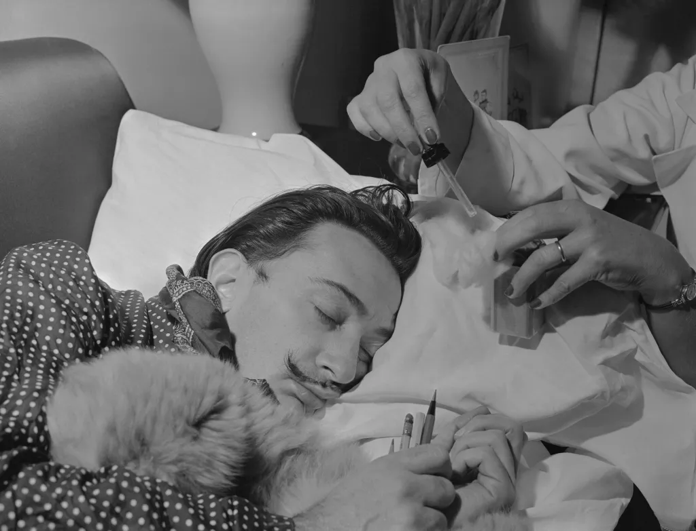

I've been taking naps multiple times a day. And surprisingly, a simple 5 minutes nap can help me avoid quite a lot of depression and anxiety.

<!--more-->

## TL;DR

Here's the routine I'm using:

1. Find an uninterrupted 30 minutes and set a 30 minutes count-down alarm [1].
2. Lie down on the couch or the bed.[2]
3. Open a random [twitch](https://www.twitch.tv/) or youtube stream. Best if they're playing a video game that I know.[3] [4]
4. Close my eye and try to visualize the game in my head
5. After about 15~20 minutes, my mind started to drift. I can feel my body sinking and my heart rate increasing. It feels like your body decided to speed up to leave you, and there's nothing you can do about it.
6. The feeling last about 5 minutes
7. My alarm goes off. I feel recharged for another 3~5 hours of work.

## The Technique

The technique is quite similar to the sleep technique used by [Salvador Dalí and Thomas Edison](https://www.livescience.com/little-known-sleep-stage-may-be-creative-sweet-spot) to boost creativity.

> To use the technique, visionaries such as Dalí and Edison would hold an object, such as a spoon or a ball, while falling asleep in a chair. As they drifted off, the object would fall, make a noise and wake them up. Having spent a few moments on the brink of unconsciousness, they would be ready to start their work.

The idea is: **You get a substantial creative recharge when staying on the edge of sleep.** You can still think, but thoughts are out of your control. It feels like you're merely an observer of your mind and body at the moment.

> This early sleep stage, known as the hypnagogia state or N1, lasts only a few minutes before you drift off to deeper sleep, but it may be the "ideal cocktail for creativity," the researchers wrote in the study, [published Dec. 8 in the journal Science Advances](https://www.science.org/doi/10.1126/sciadv.abj5866).

I have a problem falling asleep. Preparing a 30 minutes slot and only expecting 5 minutes of rest makes the process much less stressful.

I tried to get a 20 minutes nap, but the thoughts of falling asleep and waking up at precise timing created too much pressure for me. I know I have a 25 minutes buffer to prepare myself for that critical 5 minutes with this technique.

## Notes

1. I use Apple Watch for the alarm. I feel a lot better waking up to its gentle alarm. The iPhone's alarm always causes me headaches.

2. Working from home helps a lot.

3. I've been a [Dota](https://www.dota2.com/home) player for more than 15 years. The game has an excellent [audio design](https://chudooder.github.io/d2acq/), so I can visualize most things happening with just audio.

4. Back in the days where streaming video games is not a thing, I try to calm myself down by recalling the game I've played that day.
