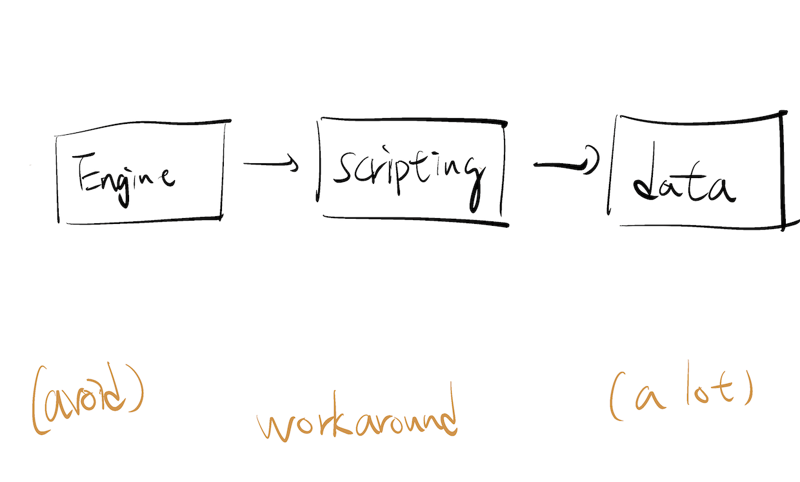

*I'm a burnt-out programmer, never an artist. Okay?*

---

I'm a typical burnt-out programmer due to typical reasons. And this time, it's particularly bad.

I literally want to throw up multiple times when I'm coding this damn game and also struggling to [finish the game](https://makegames.tumblr.com/post/1136623767/finishing-a-game).

But I still made it across the finish line. The game sucks so much that I don't know if it can be called a game. But I made it.

And now, I can share this cute vibing chicken with you.

## Iterating Game Idea is Hard

The game started as a [Vampire-Survivor](https://store.steampowered.com/app/1794680/Vampire_Survivors/)-like action game, then it becomes a farming simulator, morphed into a [rogue-like](https://en.wikipedia.org/wiki/Roguelike) strategy game with meta-progression, and finally to a bare-bone music player that beeps when you mouse-over an egg.

What I learned is: The game engine barely matters.

The first step of [finishing a game](https://makegames.tumblr.com/post/1136623767/finishing-a-game) is finding a core loop that's fun: collecting stuff, shooting at things, running across obstacles. Any game engine can support almost any kind of core loops.

The hardest part is about iterating as fast as possible to find a fun core loop before you decide to give up. And I struggled so much on this front due to my inexperience in game development and tooling.

## The 3-tiers Architecture for Games

~2010 is the last time I made a game. The only thing I still remember is the 3-tier architecture for games (and sorry, I can't find anything online):

The idea is: Your engine should be solid and correct, but games are inherently messy and full of edge cases. So push those workarounds into your data (like duplicated entry, weird value for special boss battle... etc) as much as possible.

I took the advice wholeheartedly, but it really requires experience to apply the pattern to modern game engines such as [Unity](https://unity.com/), [Unreal](https://www.unrealengine.com/en-US), or [Godot](https://godotengine.org/).

My game is a bunch of spaghetti [GDScript](https://docs.godotengine.org/en/stable/tutorials/scripting/gdscript/gdscript_basics.html) that slowed down my prototyping quite a lot. And it's mostly my fault.

## The Speed of Iterating

"Live Reloading" may be optional for system programming or web development, but IMO it's the essence of game development. You don't want to restart the game, play it to a certain state (it might takes 5 minutes), then finally see that your minor design tweak doesn't work.

The 3-tier architecture is designed for live-reloading; each tier can be reloaded dynamically. so the best case is you should never leave your game and have an extremely short feedback loop.

I tried to force myself to avoid complex architecture and taste the tool (in this case, GDScript) the engine wants me to use. It worked. If I'm not forcing myself to do so, I don't think I can finish the game. Instead, I will be drowning in the sea of refactoring and technologies.

And it makes me want more.

## Then I remembered

Then I remembered that I'm a pretty good hacker. As long as I have the code, I can make it do whatever I want in the worst possible way.

What if I integrate it with some Lisp-like languages, since Lisp is the holy grail of mixing data and code?

What if I focus on making a better data-driven design tool that runs on a spreadsheet engine?

Since it's my own game, What if I use whatever exotic language I like: [Ocaml](https://ocaml.org/), [Haxe](https://haxe.org/) , or [janet](https://janet-lang.org/) without caring about "teammates"?

But most importantly, I remembered that I started programming because I like games. And now I want to make more games before my life ends. There's so many things I cannot control. So I need to make games now.

And at least I drew this egg.

