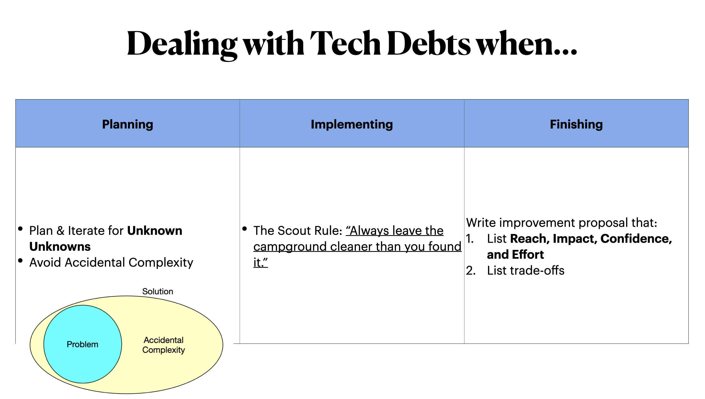

Here's the rough transcript of a talk I've given at my *$DayJob*.

---

## On Dealing with Tech Debts

Tech debts has been a sin of software engineers since the dawn of the computer. Today I will talk about concrete methods I've been using for many years. I will not talk about high-level ideas since we already have way too many on the internet.

So the method is simple: **You want to constantly dealing with tech debts during your development process**, not just after finished a task, not arranging a special sprint for debts.

First, while planning for a new task, try to plan for the unknown unknowns. Leave some buffer in your schedule and prepared for the worst. But don't over-planning.

Second, you should try to avoid accidental complexities as much as possible. Accidental Complexity is the mismatch of a requirement(problem) and a solution. It's also the source of tech debts.

We can never completely avoid accidental complexity since we need to deal with legacy codes, performance issues, time to markets, or costs. But every line of code we wrote thats not for the requirement is a line of code that's not being active used by our customer and hence badly maintained.

My favorite method of avoiding accidental complexity is simple: For each requirement, re-write your solution 7 times. Each time you re-write, you understand the requirement more, you will write a simpler solution that's much more maintainable. **Understanding the problem is the only defence against accidental complexity**.

--

While implementing a task, follow the scout rule. Any 1% improvement is good since we're looking across the whole team instead of your own improvement.

--

When finishing a task, try to write down what can be improved in a language that stakeholders can understand so they can prioritize. There's lots of framewor of doing prioritization. IMO [RICE framework](https://www.intercom.com/blog/rice-simple-prioritization-for-product-managers/) is a pretty easy to use one. Try that first.

---

## Q&As

Q: If engineers want to help their team deliver product value to customers fast and smoothly
- what R&R should they have?
- And how to make the first step?

A: Product Management is all about resource allocation. As an engineer you should (roughly in this order):
- You show that you're a resource that's reliable and trustable
- You help PMs utilize you efficiently
- You improve the whole team's efficiency (with system design, process, or communication)

--

Q: How to use our energy wisely to have a better balance between product development and technical investment?

A: Technical Investment means nothing if it doesn’t create impacts. Learn to justify technical investment using PM’s language: Reach, Impact, Confidence, and Effort.
Some suggestions:
- Whenever you need to propose 1 solution, propose 3. List their trade-off and RICE so PMs can quickly make decisions.
- Learning is part of your job. Don’t spend 100% of your time on implementation.

---

## Still not sure?

- Start a conversation with your team lead.
- Share your experience
  - In this meeting
  - In private
  - In 1-1s
