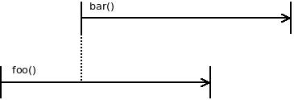
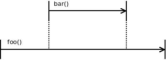

Thread 跟 Coroutine 是兩種常常用來處理 Concurrency 的工具。

使用這兩個工具時，很麻煩的一點就是需要手動管理他們的生命週期。本質上，Thread 跟 Coroutine 都是 global scope，不管你如何建立，他們都獨立在原本的程式順序之外。

常見的例子是，如果你在 main 建立一個新的 thread，main 並不會等 thread 結束，而需要你手動 join thread，在複雜的情況（例如 cancel、timeout）便相當容易出錯。

而 Structured Concurrency 就是試圖將 Thread 的生命週期與大家都很熟悉的 scope 結合。

## 什麼是 Structured Concurrency

Structured Concurrency 透過 function scope 明確表示 thread 之間的巢狀關係。借用 [libdill](http://libdill.org) 的圖([http://libdill.org/structured-concurrency.html](http://libdill.org/structured-concurrency.html))：

沒有 Structured Concurrency 的情況：

有 Structured Concurrency 的情況：

## 為什麼要做 Structured Concurrency

Thread 跟 coroutine 的全域性質破壞了封裝（encapsulation）：在一個 function 內建立的物件竟然會 leak 到 global scope，造成了管理上的困難。

而 Structured Concurrency 讓我們能建立出熟悉的 scope tree：

## Implementation

[libdill](http://libdill.org) 是個在 C 實做 Structured Concurrency 的函示庫。在 [Kotlin](https://kotlinlang.org/) 這類較現代的語言中甚至直接[內建了](https://kotlinlang.org/docs/reference/coroutines/basics.html#structured-concurrency)。

---

有時原始的 Thread 寫起來太瑣碎，這類設計還是能幫人省很多時間的。

#### References

* [libdill: Structured Concurrency for C](http://libdill.org/structured-concurrency.html)
* [Structured concurrency](https://medium.com/@elizarov/structured-concurrency-722d765aa952)
* [Getting rid of state machines (I)](http://250bpm.com/blog:69)
* [Getting rid of state machines (II)](http://250bpm.com/blog:70)
* [Structured Concurrency](http://250bpm.com/blog:71)
* [Two Approaches to Structured Concurrency](http://250bpm.com/blog:139)
* [Notes on structured concurrency, or: Go statement considered harmful](https://vorpus.org/blog/notes-on-structured-concurrency-or-go-statement-considered-harmful/)

