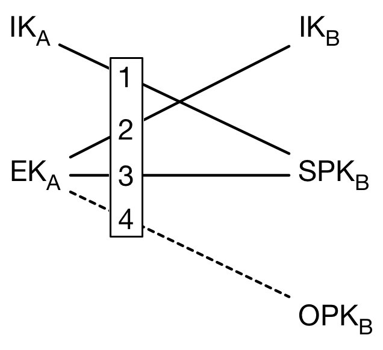

> So, I assume you're already familiar with [Public-key cryptography](https://en.wikipedia.org/wiki/Public-key_cryptography) and [Diffie-Hellman key exchange](https://en.wikipedia.org/wiki/Diffie%E2%80%93Hellman_key_exchange). If not, there are lots of good materials about them. Check them out first!

Public-key cryptography is a solid, well-studied foundation for today's modern encryption and privacy. PGP, Diffle-Hellman, and RSA are all well-known. However, if you want to develop something with encryption, they might be not enough.

<!--more-->

Why?

### User Experience

**With vanilla public-key cryptography, the private key IS your identity**. Everything is doomed if you lose your private key. Unfortunately, it's really, really hard to correctly backup and protect your private key without sacrificing security. For normal people, they might lose their phone. Their computer might be spoiled by a cup of coffee. And it's notoriously hard to maintain a working backup for any data.

As you already know, we live in a mobile world. People have multiple devices at their hand. It's unacceptable if they can only use one device to represent themselves. It's common to use a phone on the road, then switch to a desktop in an office.

Finally, people expect good discoverability for content. Long gone the days people manually collect and share links through different channels. Good discoverability is also useful for bootstrapping a new community.

The UX bar is already set. We need to catch up.

### Privacy

**"Keep your private key private" is difficult in this surveillance capitalism world.**

State-sponsored attack is common. User data is in the hands of mega-corps. Internet traffic is constantly monitored. We need a practical, cheap, and easy solution for normal people with the following properties:

* Easy to backup
* Forward/backward secrecy
* Break-in recovery

### Signal Protocol

Signal is an end-to-end encrypted messaging application. It uses its own protocol called [Signal Protocol](https://signal.org/docs/). The protocol is based on the solid foundation of cryptography and is also adapted by many other messaging applications. The document is also well-written and easy to understand.

In the following article, we will understand how it solve issues mentioned in the previous paragraph.

Let's get started with Diffie-Hellman key exchange and X3DH.

---

## Diffie-Hellman Key Exchange and X3DH

Instead of DH key exchange, Signal Protocol used a variation of it named ["X3DH" (Extended Triple Diffie-Hellman)](https://signal.org/docs/specifications/x3dh/).

> Note: Since the X3DH document is well-written and is in the public domain. Some of the following text is copied from the origin document with addition of my own notes.

X3DH is designed for asynchronous settings where one user ("Bob") is offline but has published some information to a server. Another user ("Alice") wants to use that information to send encrypted data to Bob, and also establish a shared secret key for future communication.

### Keys

X3DH uses the following elliptic curve public keys:

* IK_A: Alice's (long-term) identity key
* EK_A: Alice's ephemeral key
* IK_B: Bob's (long-term) identity key
* SPK_B: Bob's signed prekey
* OPK_B: Bob's one-time prekey

All public keys have a corresponding private key, but to simplify description we will focus on the public keys.

Bob has a signed prekey *SPK_B*, which he will change periodically, and a set of one-time prekeys *OPK_B*, which are each used in a single X3DH protocol run. ("Prekeys" are so named because they are essentially protocol messages which Bob publishes to the server*prior*to Alice beginning the protocol run).

During each protocol run, Alice generates a new ephemeral key pair with public key *EK_A*.

After a successful protocol run Alice and Bob will share a 32-byte secret key *SK*. This key may be used within some post-X3DH secure communication protocol, subject to the security considerations.

### The X3DH Protocol

 [https://signal.org/docs/specifications/x3dh/](https://signal.org/docs/specifications/x3dh/)

### One-time Prekeys

One-time prekeys are essential for forward-secrecy.

If no one-time keys are used, the key agreement just uses two keys: The identity key and the*signed prekey*. They're both long-term-ish keys. If an attacker get both long-term keys, they can calculate the shared secret.

Adding a one-time prekey to the calculation makes the shared secret be based on a truly ephemeral key on both sides of the communication.

### Deniability

Instead of non-repudiation, X3DH provides an interesting property: Deniability.

X3DH doesn't give either Alice or Bob a publishable cryptographic proof of the contents of their communication or the fact that they communicated.

---

## Double Ratchet

The Double Ratchet algorithm is used by two parties to exchange encrypted messages based on a shared secret key. Typically the parties will use some key agreement protocol (such as X3DH) to agree on the shared secret key. Following this, the parties will use the Double Ratchet to send and receive encrypted messages.

The parties derive new keys for every Double Ratchet message so that earlier keys cannot be calculated from later ones. The parties also send Diffie-Hellman public values attached to their messages. The results of Diffie-Hellman calculations are mixed into the derived keys so that later keys cannot be calculated from earlier ones. These properties gives some protection to earlier or later encrypted messages in case of a compromise of a party's keys.

### The Protocol

[https://signal.org/docs/specifications/doubleratchet/](https://signal.org/docs/specifications/doubleratchet/)

### KDF Chains

A KDF chain has the following properties:

* **Resilience**: The output keys appear random to an adversary without knowledge of the KDF keys. This is true even if the adversary can control the KDF inputs.
* **Forward security**: Output keys from the past appear random to an adversary who learns the KDF key at some point in time.
* **Break-in recovery**: Future output keys appear random to an adversary who learns the KDF key at some point in time, provided that future inputs have added sufficient entropy.

In a **Double Ratchet session** between Alice and Bob each party stores a KDF key for three chains: a **root chain**, a **sending chain**, and a **receiving chain** (Alice's sending chain matches Bob's receiving chain, and vice versa).
As Alice and Bob exchange messages they also exchange new Diffie-Hellman public keys, and the Diffie-Hellman output secrets become the inputs to the root chain.

The output keys from the root chain become new KDF keys for the sending and receiving chains. This is called the **Diffie-Hellman ratchet**.

The sending and receiving chains advance as each message is sent and received. Their output keys are used to encrypt and decrypt messages. This is called the **symmetric-key ratchet**

### Root Key

Introduction of Root key is a critical element in ensuring break-in recovery.

Since the Root key is bootstrapped at the beginning of establishing the communication between A and B. There's no way a MITM attacker could have compromised the root key. Such attacker intent to build the corresponding chains to match up to A's sending chain and B's receiving chain to successfully establish a working MITM.

Due to the introduction of root key in the DH ratchet, the attacker can't generate corresponding sending/receiving chain. The attacker's window of interception after a chance compromise of a 'message key' is limited until the next opportunistic 'DH ratchet' cycle.

### Out-of-Order Messages

The Double Ratchet handles lost or out-of-order messages by including in each message header the message's number in the sending chain (*N*=0,1,2,...) and the length (number of message keys) in the previous sending chain (*PN*). This enables the recipient to advance to the relevant message key while storing skipped message keys in case the skipped messages arrive later.

---

## Multi-Device Support

As previously stated, we're in a world where almost everyone have multiple connected devices. It creates interesting challenges for modern cryptography.

First, it's undesirable to have multiple devices being complete separated identities if they're owned by the same person. It's confusing if the people I'm chatting with think my phone and my desktop are two different people.

Second, people are not perfect. They might lost their phone, break their laptop, and consequently lost their private key. We need to identify the connection between multiple devices and migrate when necessary.

To solve these issues, Signal use the [Sesame Algorithm]( [https://signal.org/docs/specifications/sesame/]https://signal.org/docs/specifications/sesame/ ) for managing message encryption sessions in an asynchronous and multi-device setting.

Sesame was designed to manage Double Ratchet sessions created with X3DH key agreement. However, Sesame is a generic algorithm that works with any session-based message encryption algorithm that meets certain conditions.

Sesame use a server to store the user-devices relation and cache user's message with mailboxes. It's essential for better user experience.

---

## End-to-End Encryption for Group Messaging

In Signal Protocol, group messaging is modeled as multiple 1:1 secure messages via sending message to each member's mailbox on the sesame server. This approach is called "client-side fan-out"

There's also a variation of Signal protocol adopted by WhatsApp called Sender Keys. It has "server-side fan-out" and enforce transcript consistency on the server. Check [their whitepaper](https://www.whatsapp.com/security/WhatsApp-Security-Whitepaper.pdf) for more information.

Secure group messaging is still an open problem. Other protocols, such as [Matrix's megolm]( [https://gitlab.matrix.org/matrix-org/olm/blob/master/docs/megolm.md]https://gitlab.matrix.org/matrix-org/olm/blob/master/docs/megolm.md) and [Message Layer Security(MLS)]( [https://blog.trailofbits.com/2019/08/06/better-encrypted-group-chat/]https://blog.trailofbits.com/2019/08/06/better-encrypted-group-chat/) ), all impose different trade-offs.

On the other hand, making a massive chat group with multiple admin secure might be a wrong problem to solve. These kind of groups is basically public chat. Why would an attacker try to break encryption if they can simply join the group and see everything?

---

## Final Word

In the end, you might ask: "Why would I need to understand this if I'm not supposed to roll my own crypto?"

"Don't roll your own crypto" is a common wisdom. However, I want to add: "based on a solid foundation if you have to."

