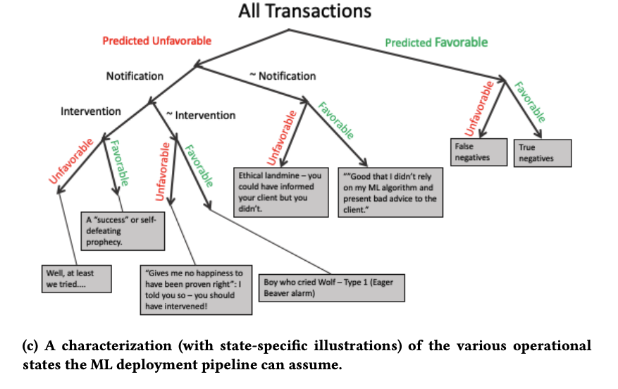

[Using AntiPatterns to avoid MLOps Mistakes](https://arxiv.org/abs/2107.00079), Nikil Muralidhar et. al.

I learned about this survey paper from [The Data Exchange](https://thedataexchange.media/mlops-anti-patterns/) podcast. It's a good introduction for people who just started deploying their machine learning project to production.

The paper focused on _supervised learning_, and _forcasting applications_. But the observation and recommendations should be general enough to be applied to other common machine learning deployments.

<!--more-->

From the abstraction:

> For the most part, we present our antipatterns in a supervised learning or forecasting context. In a production ML context, there is typically a model that has been approved for daily use. Over time, such a model might be replaced by a newer (e.g., more accurate) model, or retrained with more recent data (but keeping existing hyperparameters or ranges constant or fixed), or retrained with new search for hyperparameters in addition to retraining with recent data.

# Patterns & Anti-patterns

We humans learn and communicate in patterns. We rely on patterns to create a common vocabulary for effective collabration. [The (in)famous Design Pattern](https://en.wikipedia.org/wiki/Design_Patterns), no matter you like it or not, saved us lot of time with vocabularies such as *Factory Pattern*.

In similar vein, the paper is also trying to name a set of patterns emerged from the real-world machine learning deployments.

> lessons learned from developing and deploying machine learning models at scale across the enterprise in a range of financial analytics applications. These lessons are presented in the form of antipatterns

Here are the patterns listed in the paper. Check [the origin paper](https://arxiv.org/abs/2107.00079) if you want to learn about the detail.

## Design & Development Anti-patterns

### Data Leakage

make use of information that is not supposed to have in production.

common examples are:

- Lags between reporting the data and the actual measurement
- incorrect sampling method to create training and test set
- oversampling BEFORE splitting the training and test test
- pre-processing or normalization BEFORE splitting the training and test set

### Tuning under the Carpet

Hyper-parameters are often extremely under-documented.

> As hyper-parameters play such a crucial role in learning, it is imperative that the part of a learning pipeline concerned with hyper-parameter optimization be explicitly and painstakingly documented so as to be reproducible and easily adaptable.

## Performance Evaluation Anti-patterns

### PEST: Perceived Empirical SuperioriTy

Keep it simple and stupid before you start trying specific methododologies.

> In our financial analytics context, we have found the KISS principle to encourage developers to try simple models first and to conduct an exhaustive comparison of models before advocating for specific methodologies. Recent benchmark pipelines like the GLUE and SQuAD benchmarks [30, 38] are potential ways to address the PEST antipattern.

### Bad Credit Assignment

Failed to understand what makes your model work (or not work). This sounds easy. But it's actually really hard when your machine learning project is a pipeline with 100+ stages.

>  the failure to appropriately identify the source of performance gains in a modeling pipeline

### Grade your own Exam

After working on the same project for a while, the machine learning practitioner naturally learned about some feature of the test set and apply the knowledge to the training process without knowing.

>  To avoid this antipattern, testing and evaluation data should be sampled independently, and for a robust performance analysis, should be kept hidden until model development is complete and must be used only for final valuation. In practice, it is not uncommon for model developers to have access to the final test set and by repeated testing against this known test set, modify their model accordingly to improve performance on the known test set. This practice called HARKing (Hypothesizing After Results are Known)

## Deployment & Maintenance Anti-patterns

### Act Now, Reflect Never

Never deploy a model straight to production without any monitoring or filtering. It's going to be a nightmare.

> predictions are used as-is without any filtering, monitoring, reflection, or manual inspection.

### Set & Forget

Old models suffer from concept drifts. **If there's only one metadata you can track, track the model creation date**.

> Decision support systems governed by data-driven models are required to effectively handle concept drift and yield accurate decisions. The primary technique to handle concept drift is learning rule sets using techniques based on decision trees and other similar interpretable tree-based

### Communicate with Ambivalence

There's always uncertainty in machine learning services. Make sure there's a way to escalate the problem when the confidence is low.

We all hate services that block you because of some "algorithms" and leave you no chance asking for help. Don't make the same mistake.

> Most ML pipelines are tuned to generate predictions but little attention is paid to ensure that the model can sufficiently communicate information about its own uncertainty

### Data Crisis as a Service

Cleaning and Preparing the Data **Properly** is really hard. De-identification requires careful inspection and monitoring.

> The development of models using data manually extracted and hygiened without recording the extraction or hygiene steps leads to a massive data preparation challenge for later attempts to validate (or even deploy) ML models. This is often the result of ‘sensitive’ data that is selectively sanitized for the modelers by some third-party data steward organization that cannot adequately determine the risk associated with direct data access. The data preparation steps are effectively swept under the carpet and must be completely reinvented later, often with surprising impact on the models because the pipeline ends up producing different data

# Rethinking ML Deployment

This is how data scientists evaluation their model (naturally, focusing on the model):

However, in real-world ML deployments, we should focus on correctness and operability of the whole pipeline. We should evaluate the whole learning and decision process against the business value instead of just the model.

**In other words, define your project scope and KPI before starting a maching learning project.**

# Recommendations

From the paper:

1. Use AntiPatterns presented here to document a model management process to avoid costly but routine mistakes in model development, deployment, and approval.
2. Use assertions to track data quality across the enterprise. This is crucial since ML models can be so dependent on faulty or noisy data and suitable checks and balances can ensure a safe operating environment for ML algorithms.
3. Document data lineage along with transformations to support creation of ‘audit trails’ so models can be situated back in time and in specific data slices for re-training or re-tuning.
4. Use ensembles to maintain a palette of models including remedial and compensatory pipelines in the event of errors. Track model histories through the lifecycle of an application.
5. Ensure human-in-the-loop operational capability at multiple levels. Use our model presented for rethinking ML deployment from Section 4 as a basis to support interventions and communication opportunities.

---

_Don’t miss the next story. Sign up for my occasional_ [_email newsletter_](https://poga.substack.com/)_. Or check the_ [_About/FAQ_](https://devpoga.org/) _page for more._

